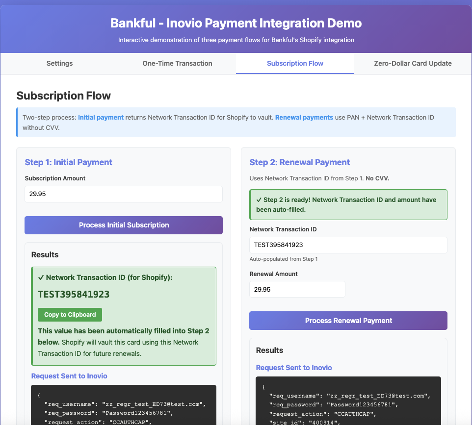

# Bankful - Inovio Payment Integration Demo

**A working demonstration of the three payment flows required for Bankful's Shopify subscription integration with Inovio.**

This demo shows Ann's team exactly how to implement the flows described in the integration requirements.

## What This Demo Shows

Based on Ann's requirements, Shopify needs three payment flows:

1. **One-Time Transactions** - Process payment, notify Shopify of success/failure
2. **Subscription Payments** - Process payment, return Network Transaction ID to Shopify
3. **Zero-Dollar Card Updates** - Validate new card, return Network Transaction ID to Shopify

**The critical concept:** The **Network Transaction ID** is what Shopify uses to vault cards and process subscription renewals without requiring CVV.

## Quick Start

### Prerequisites
- Docker and Docker Compose installed

### Run the Demo

```bash
docker-compose up --build
```

Open your browser to: **http://localhost:3000**

### Enter Your Inovio Credentials

At the top of the page:
- Inovio API Username
- Inovio API Password
- Site ID
- Product ID
- Check **"Disable Fraud Scrub Rules"** (for testing)
- Leave Merchant Account ID blank

All card details and billing information are pre-filled with test data. Just click the buttons to see each flow in action.

### Stop the Demo

```bash
docker-compose down
```

## The Three Flows

### Flow 1: One-Time Transaction

**What Shopify Needs:** Just notification of transaction success or failure.

**What the Demo Shows:**
- Click the "One-Time Transaction" tab
- Click "Process One-Time Payment"
- See the exact API request/response
- Notice: No Network Transaction ID needed

**Implementation:** Process payment with Inovio, return success/failure to Shopify. Done.

---

### Flow 2: Subscription Payment (Two Steps)

**What Shopify Needs:** A way to process recurring payments without CVV.

#### Two Implementation Options

You have two choices for handling subscription renewals:

**Option 1: Network Transaction ID Approach** *(Demonstrated in this app)*

- **What it is:** Uses the card scheme's Network Transaction ID (from Visa, Mastercard, etc.)
- **How it works:**
  - Step 1: Extract `CARD_BRAND_TRANSID` from initial payment response
  - Step 2: Pass it as `ORIG_CARD_BRAND_TRANSID` for renewal payments (no CVV needed)
- **When to use:** Shopify cannot pass REQUEST_REBILL=1

**Option 2: CUST_ID Approach** *(Preferred approach)*

- **What it is:** Uses Inovio's customer ID instead of Network Transaction ID
- **How it works:**
  - Step 1: Extract `CUST_ID` from initial payment response and store it
  - Step 2: Pass `CUST_ID` with `REQUEST_REBILL=1` for renewal payments (no CVV needed)
- **When to use:** Shopify can pass REQUEST_REBILL=1 (preferred approach)
- **Note:** CUST_ID can be stored as the Network Transaction ID on the Shopify side
- **Benefit:** Backwards compatible with processors that don't support NETWORK TRANSACTION IDs yet.

**Note:** The demo below shows Option 1 (Network Transaction ID approach).


*Visual overview of the two-step subscription process: Initial payment returns an identifier (Network Transaction ID or CUST_ID), which is used for all future renewals without CVV.*

#### Step 1: Initial Subscription Payment

**What the Demo Shows:**
- Click the "Subscription Flow" tab
- Click "Process Initial Subscription"
- **Watch:** Network Transaction ID appears in a large green box
- **Watch:** The value auto-fills into Step 2 below
- **Watch:** Page scrolls to Step 2 with success message

**Implementation:** See "Two Implementation Options" above for how to extract either `CARD_BRAND_TRANSID` (Option 1) or `CUST_ID` (Option 2).

#### Step 2: Subscription Renewal

**What the Demo Shows:**
- Network Transaction ID and amount are already filled in from Step 1
- **Notice:** No CVV field - renewals don't require CVV
- Click "Process Renewal Payment"
- See the request includes PAN + Network Transaction ID but NOT CVV

**Implementation:** See "Two Implementation Options" above for how to use either `ORIG_CARD_BRAND_TRANSID` (Option 1) or `CUST_ID` + `REQUEST_REBILL=1` (Option 2).

---

### Flow 3: Zero-Dollar Card Update

**What Shopify Needs:** Network Transaction ID for the new card to update subscription.

**What the Demo Shows:**
- Click the "Zero-Dollar Card Update" tab
- Click "Process Zero-Dollar Authorization"
- See $0.00 authorization processed
- Network Transaction ID appears in green box

**Implementation:** Process $0.00 authorization with Inovio using `REQUEST_ACTION=CCAUTHORIZE` and `LI_VALUE_1=0.00`, extract `CARD_BRAND_TRANSID`, return this Network Transaction ID to Shopify.

## Understanding the Network Transaction ID

The Network Transaction ID is returned by Inovio in the `CARD_BRAND_TRANSID` response field. This is the card scheme transaction ID from the card network (Visa, Mastercard, etc.).

**When to return it to Shopify (Option 1 - Network Transaction ID approach):**
- ✓ Initial subscription payment
- ✓ Zero-dollar card updates
- ✗ One-time transactions (not needed)
- ✗ Subscription renewals (used as input, not output)

**Alternative: CUST_ID Approach (Option 2):**

If your processor doesn't support Network Transaction ID, you can use `CUST_ID` instead:
- Extract `CUST_ID` from the initial subscription payment response
- Store it for future use
- Pass it with `request_rebill=1` for subscription renewals
- **Benefit:** Provides broader processor compatibility for merchants whose processors don't support Network Transaction ID

## What's in the Code

### Backend (`src/`)
- `server.js` - Express server with comprehensive inline documentation for Ann's team
- `inovioClient.js` - Inovio API client with integration notes

**The backend code includes detailed comments explaining:**
- Exact parameters for each flow
- Required vs optional fields
- How to extract Network Transaction ID
- Shopify integration points
- Common errors and solutions

### Frontend (`public/`)
- Interactive UI showing exact API requests/responses
- Pre-filled test data (Visa test card, test customer info)
- Visual feedback (green boxes, auto-population, copy buttons)

### Docker
- `Dockerfile` - Node.js 18 Alpine
- `docker-compose.yml` - Single container, no volumes

## For Ann's Team

### Implementation Checklist

**One-Time Payments:**
- [ ] Accept payment from Shopify
- [ ] Send to Inovio with `REQUEST_ACTION=CCAUTHCAP`
- [ ] Return success/failure to Shopify

**Initial Subscription Payments (Option 1 - Network Transaction ID):**
- [ ] Accept payment from Shopify
- [ ] Send to Inovio with `REQUEST_ACTION=CCAUTHCAP`
- [ ] Extract `CARD_BRAND_TRANSID` from response
- [ ] **Return Network Transaction ID to Shopify**

**Initial Subscription Payments (Option 2 - CUST_ID):**
- [ ] Accept payment from Shopify
- [ ] Send to Inovio with `REQUEST_ACTION=CCAUTHCAP`
- [ ] Extract `CUST_ID` from response
- [ ] Store CUST_ID for future renewals

**Subscription Renewal Payments (Option 1 - Network Transaction ID):**
- [ ] Accept PAN + Network Transaction ID from Shopify (no CVV)
- [ ] Send to Inovio with `REQUEST_ACTION=CCAUTHCAP` and `ORIG_CARD_BRAND_TRANSID`
- [ ] Return success/failure to Shopify

**Subscription Renewal Payments (Option 2 - CUST_ID):**
- [ ] Accept payment details from Shopify (no CVV)
- [ ] Send to Inovio with `REQUEST_ACTION=CCAUTHCAP`, `CUST_ID`, and `REQUEST_REBILL=1`
- [ ] Return success/failure to Shopify
- [ ] **Benefit:** Works with processors that don't support Network Transaction ID

**Zero-Dollar Card Updates:**
- [ ] Accept new card from Shopify
- [ ] Send to Inovio with `REQUEST_ACTION=CCAUTHORIZE`, `LI_VALUE_1=0.00`
- [ ] Extract `CARD_BRAND_TRANSID` from response
- [ ] **Return Network Transaction ID to Shopify**

### Key Takeaways

1. **Network Transaction ID is critical** - Shopify needs this to vault cards for subscriptions
2. **Renewals don't use CVV** - Just PAN + Network Transaction ID
3. **Three distinct flows** - One-time (no vaulting), subscription (vault with ID), card update (re-vault with new ID)
4. **The code shows exact implementation** - Review `src/server.js` for detailed comments

### Testing This Demo

1. Enter your real Inovio credentials
2. Check "Disable Fraud Scrub Rules" (for testing)
3. Run through all three flows
4. See exact requests/responses
5. Use the code patterns in your implementation

## Common Issues

**Transaction Declined (Scrub Decline or Invalid CPF):**
- Check the "Disable Fraud Scrub Rules" checkbox at the top
- Leave Merchant Account ID blank

**Network Transaction ID Missing:**
- Verify transaction was approved
- Check Inovio response for `CARD_BRAND_TRANSID`, `PROC_REFERENCE_NUM`, or `PROC_RETRIEVAL_NUM`

## References

- Complete Inovio API documentation: `API.md`
- Ann's integration requirements: `plan.txt`
- Inovio API endpoint: https://api.inoviopay.com/payment/pmt_service.cfm
- API version: 4.12

## Architecture

**Backend:** Node.js + Express
**Frontend:** HTML/CSS/JavaScript
**Containerization:** Docker
**API Format:** URL-encoded requests, JSON responses

All technical details and field documentation are in the code comments (`src/server.js` and `src/inovioClient.js`).
